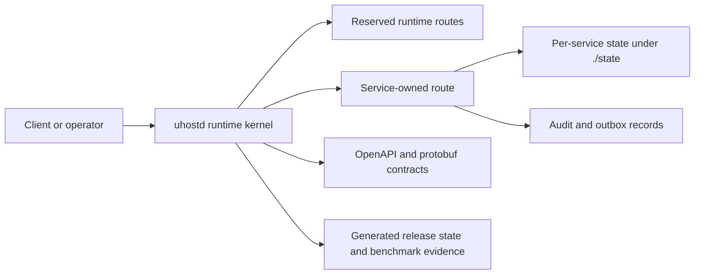

# UHost Architecture

UHost is a Rust workspace that currently ships as a same-host control-plane beta centered on [`cmd/uhostd`](../cmd/uhostd). The codebase is intentionally decomposed into bounded-context services and shared crates, but the default runtime is still one process with file-backed durability under `./state`.

That split is deliberate. The repository already has real service boundaries, explicit route ownership, generated contracts, and a meaningful UVM stack. The public presentation should stay centered on that shipped shape.

## Beta Shape

| Layer | What ships in beta | Notes |
| --- | --- | --- |
| Runtime kernel | [`crates/uhost-runtime`](../crates/uhost-runtime) | Owns route dispatch, reserved runtime paths, API-surface classification, and connection/time-limit policy. |
| Shared foundations | [`crates/uhost-api`](../crates/uhost-api), [`crates/uhost-core`](../crates/uhost-core), [`crates/uhost-store`](../crates/uhost-store), [`crates/uhost-types`](../crates/uhost-types) | Shared HTTP helpers, config loading, storage primitives, IDs, validation, and runtime data types. |
| Control-plane services | [`services`](../services) | Twenty-seven bounded contexts with local durable state and service-owned route families. |
| Contracts and generated truth | [`openapi/control-plane-v1.yaml`](../openapi/control-plane-v1.yaml), [`proto/control-plane-v1.proto`](../proto/control-plane-v1.proto), [`docs/generated/release-state.md`](generated/release-state.md) | Contracts are explicit; mutable status facts are generated instead of hand-maintained. |
| UVM stack | [`crates/uhost-uvm`](../crates/uhost-uvm), [`crates/uhost-uvm-machine`](../crates/uhost-uvm-machine), [`crates/uhost-uvm-softvm`](../crates/uhost-uvm-softvm), [`cmd/uhost-uvm-runner`](../cmd/uhost-uvm-runner) | Software-first execution and validation stack with control/image/node/observe surfaces. |

## System Sketch

## Beta Deployment Model

- The supported baseline is an all-in-one [`uhostd`](../cmd/uhostd) process.
- Durable local state lives under `./state`, segmented by service ownership.
- The checked-in development config is [`configs/dev/all-in-one.toml`](../configs/dev/all-in-one.toml).
- The checked-in production template is intentionally secret-free and expects deploy-time secret injection through config overlays or environment variables.
- Activation manifests exist for `all_in_one`, `edge`, `controller`, `worker`, and `node_adjacent` compositions, but the default operator path is still single-host and one-process.

## Runtime Architecture

The core request path is:

1. [`cmd/uhostd`](../cmd/uhostd) loads configuration and constructs the runtime.
2. [`PlatformRuntime::dispatch()`](../crates/uhost-runtime/src/lib.rs) resolves the owned route from the central route registry.
3. Reserved runtime routes such as `/healthz`, `/metrics`, and `/runtime/topology` stay runtime-owned and cannot be shadowed by services.
4. The selected service handles the request through its `HttpService::handle()` implementation.
5. Mutating operations persist service-owned records and append audit or outbox entries as part of the same bounded context.

### API surfaces

| Surface | Intended audience | Current posture |
| --- | --- | --- |
| Public | Unauthenticated or carefully limited entry points | Narrow and service-specific. |
| Tenant | Tenant and workload flows | Selected routes can admit workload bearer tokens via the identity layer. |
| Operator | Human control-plane operations | Tightly gated; bootstrap-oriented admin access is still part of the beta posture. |
| Runtime | Kernel-owned health and topology endpoints | Reserved to the runtime layer. |

The important beta truth is that route ownership and surface classification are explicit and startup-validated. The important limit is that this still does not add up to a full production federation and secret-distribution story.

## Data And Durability Model

- Each service owns its own durable document tree under the configured state root.
- The default local persistence adapter is [`DocumentStore`](../crates/uhost-store/src/document.rs), which provides optimistic concurrency and soft-delete support.
- Services are expected to preserve version-aware writes and concurrency headers on mutating APIs.
- Critical mutations append audit or outbox records rather than mutating state silently.
- Generated status and evidence live outside the request path in artifacts such as [`docs/generated/release-state.md`](generated/release-state.md) and [`docs/benchmarks/generated`](benchmarks/generated).

This means the beta is durable and inspectable on one host. It does not yet mean the metadata substrate is distributed or that the event path is globally relayed.

## Identity And Access Model

- Identity, tenancy, and operator access are first-class concerns in the codebase.
- Tenant routes can admit workload bearer tokens where the service explicitly supports them.
- Operator and runtime paths remain tightly protected and still rely on bootstrap-oriented local admin flows in the current baseline.
- The checked-in production template does not contain secrets; deployers must inject them at runtime.

For beta users, the right mental model is: strong route ownership and access separation on one host, not yet enterprise-grade federation across a distributed control plane.

## Service Domains In Beta

| Domain | Services | Beta note |
| --- | --- | --- |
| Core control and tenancy | `identity`, `tenancy`, `control`, `scheduler`, `node`, `lifecycle`, `console` | Core control-plane and operator baseline for same-host deployments. |
| Network and traffic | `ingress`, `dns`, `netsec`, `mail` | Edge, routing, DNS, and policy capabilities with local durability and summary surfaces. |
| Data and trust | `storage`, `data`, `secrets`, `policy`, `governance`, `abuse` | Stateful operations, protection controls, and operator visibility for data and trust workflows. |
| Commercial and operations | `billing`, `notify`, `observe`, `ha` | Billing, notifications, observability, and failover/readiness workflows in beta form. |
| Emerging product families | `container`, `stream` | Early bounded-context services present in-tree, but not yet mature enough to market as full product lines. |
| UVM and runtime-adjacent | `uvm-control`, `uvm-image`, `uvm-node`, `uvm-observe` | Control, image, runner supervision, and evidence surfaces for the software-first UVM stack. |

## UVM Architecture In Beta

The UVM effort is a real repository surface, not a placeholder. In beta it should be described as a software-first execution and validation stack:

- [`crates/uhost-uvm`](../crates/uhost-uvm) defines core UVM types and validation primitives.
- [`crates/uhost-uvm-machine`](../crates/uhost-uvm-machine) and [`crates/uhost-uvm-softvm`](../crates/uhost-uvm-softvm) provide the software VM and guest execution substrate.
- [`cmd/uhost-uvm-runner`](../cmd/uhost-uvm-runner) and the UVM services provide control-plane integration, image handling, supervision, and evidence reporting.
- Generated benchmark and validation artifacts live under [`docs/benchmarks/generated`](benchmarks/generated).

The beta claim stops there. UVM is under active development and has generated evidence, but the repository does not yet claim hypervisor parity, certified isolation, or production VM-substrate superiority.

## Beta Scope And Non-Goals

The current beta does not claim:

- distributed metadata, workflow, or event-bus substrate,
- multi-process control-plane deployment as the normal operating mode,
- multi-cell or active-active regional control,
- full enterprise federation and secret-distribution depth,
- public-cloud parity with AWS or GCP,
- or certification-grade VM isolation or performance claims.

Those topics belong in the roadmap, not in the description of what the current beta already is.

## Where To Go Next

If you are new to the repository, this is the recommended reading order:

1. [`README.md`](../README.md) for repo-level positioning and local entry points.
2. [`docs/api/README.md`](api/README.md) for the contract surface.
3. [`docs/generated/release-state.md`](generated/release-state.md) for generated status and evidence links.
4. [`status.md`](status.md) for the current beta shape and boundaries.
5. [`roadmap.md`](roadmap.md) for the next technical phases.
6. Service-local `README.md` files under [`services`](../services) for bounded-context behavior and endpoints.
